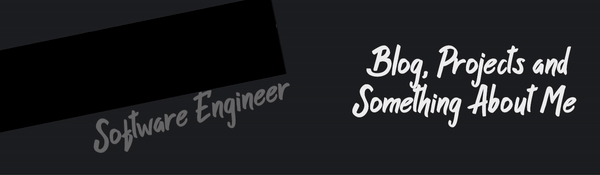

[](https://kieza17.github.io/)

# Hallo semuanya! 

Hai semua perkenalkan nama saya `Calya Kieza Atafadila` biasa dipanggil `Keja`. Banyak yang mengenal saya dengan nama `Kieza17`. Saya baru berumur `15 Tahun`, Hobi saya adalah : `Coding, Rebahan, Game, Makan, Tidur`. Saya bisa ngoding sejak kelas `6 SD`. Mungkin kalian baru tau kalau saya bisa ngoding. Sekian `Terimakasih!~`


## @Kieza17 ~ Codingers

```js
const keja = () => {
  return {
    name: "Kieza17" | "Keja" | "Calya Kieza",
    about_me: ["Front end Web Development", "Back end Web Development", "Rebahan Only", "Game Only", "Coding Only"],
    experience: {
        front_end: ["Html", "Css", "Javascript", "Responsive Mobile"],
        back_end: ["NodeJS", "PHP", "ExpressJS"],
        rebahan: ["Rumah"],
        game: ["Mobile Legends"],
        coding: ["All Only"]
    },
    medsos:{
        Whatsapp: "https://api.whatsapp.com/send?phone=6285601459079&text=Hallo+Keja",
        Instagram: "https://www.instagram.com/_calyza",
        Telegram: "https://t.me/Kieza17",
        Youtube: "https://www.youtube.com/channel/UC_WV7gCRT0oaEDrcGxiyjGA",
        Website: "https://kieza17.github.io/"
    },
    description: "I love coding, I aspire to be a professor. Hope all come true. Aamiin.."
  }
}
```

## &#x1f4c8; GitHub Statsus

<a href="#">
  
</a>
<a href="#">
  
</a>

<a href="https://github.com/Kieza17/spam-wa-console">
  
</a>
<a href="https://github.com/Kieza17/kalkulator">
  
</a>
<a href="https://github.com/Kieza17/link-wa">
  
</a>
<a href="https://github.com/Kieza17/link-wa">
  
</a> 
